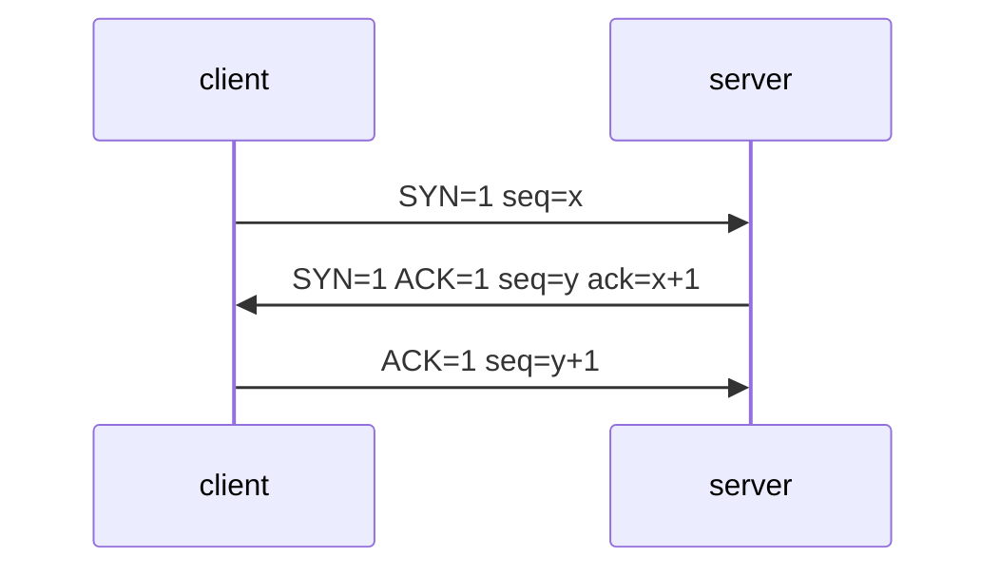
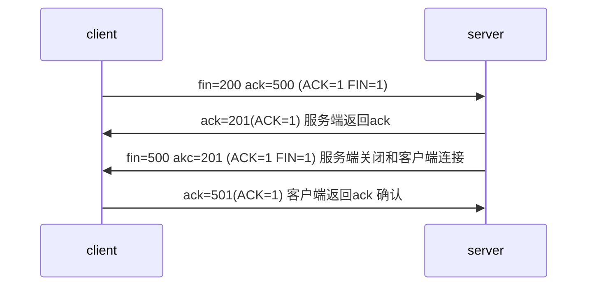

```mermaid
sequenceDiagram
	participant client
	participant server
	
	client->>server:SYN=1 seq=x  
	server->>client:SYN=1 ACK=1 seq=y ack=x+1
	client->>server:ACK=1 seq=y+1 
	
	
```

```mermaid
sequenceDiagram
	participant client
	participant server
	
	client->>server:fin=200 ack=500 (ACK=1 FIN=1) 
	server->>client:ack=201(ACK=1) 服务端返回ack
	server->>client:fin=500 akc=201 (ACK=1 FIN=1) 服务端关闭和客户端连接
	client->>server:ack=501(ACK=1) 客户端返回ack 确认
```

