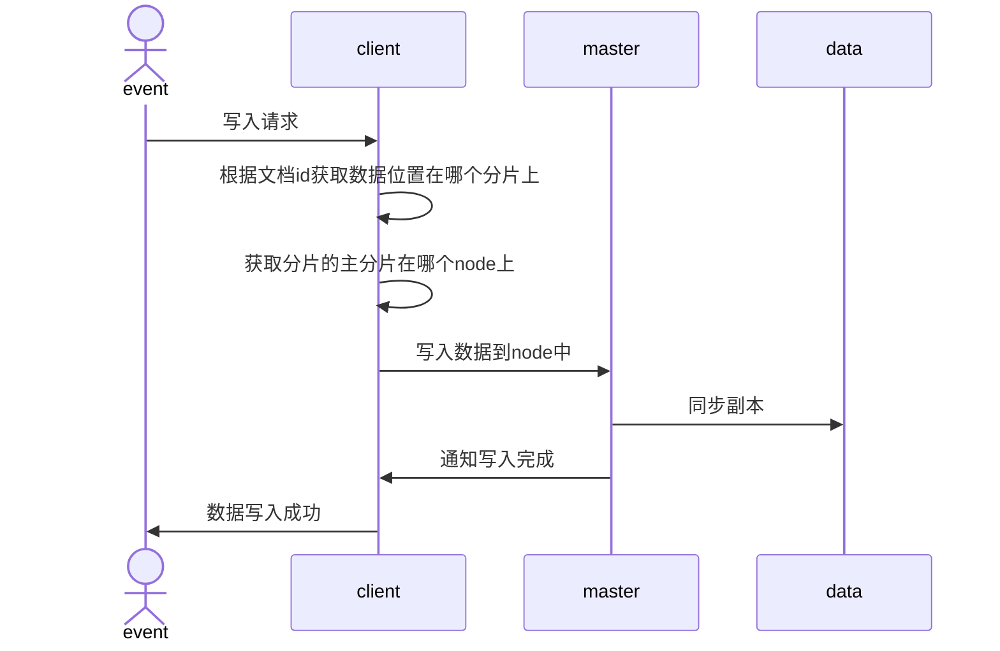
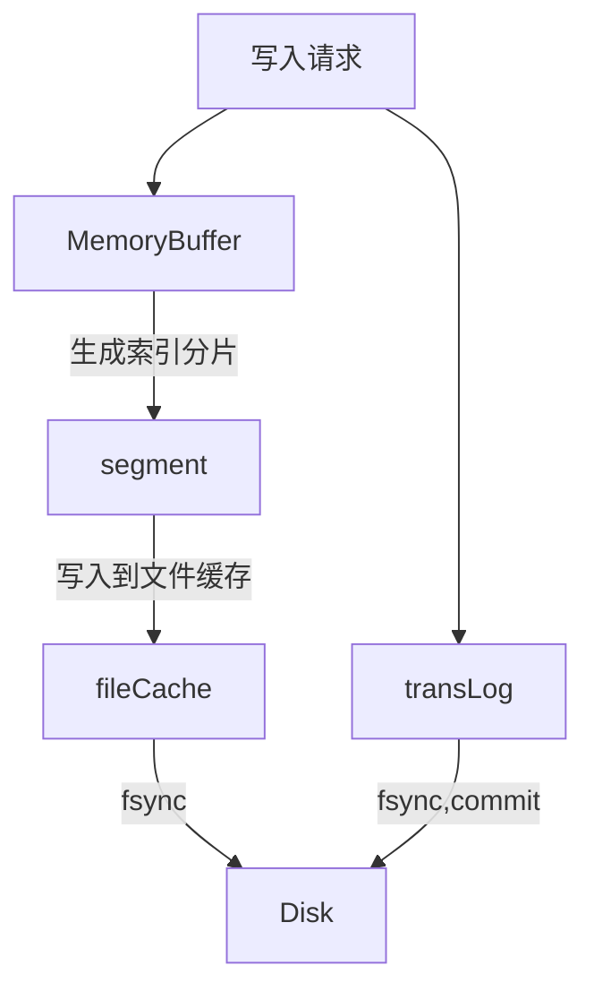

```mermaid
sequenceDiagram

    actor event
    participant client
    participant master
    participant data
    
    event->>client:写入请求
    client->>client:根据文档id获取数据位置在哪个分片上
    client->>client:获取分片的主分片在哪个node上
    client->>master:写入数据到node中
    master->>data:同步副本
    master->>client:通知写入完成
    client->>event:数据写入成功

```

```mermaid
graph TB;
写入请求-->MemoryBuffer
写入请求-->transLog
MemoryBuffer--生成索引分片-->segment
segment--写入到文件缓存-->fileCache--fsync-->Disk
transLog--fsync,commit -->Disk
```

