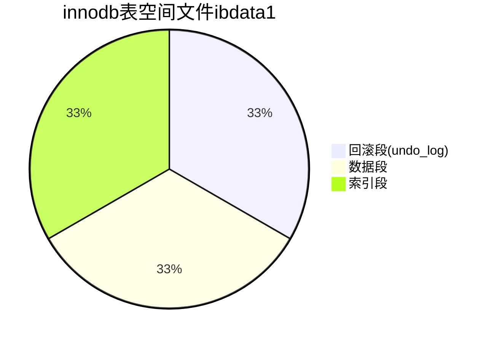
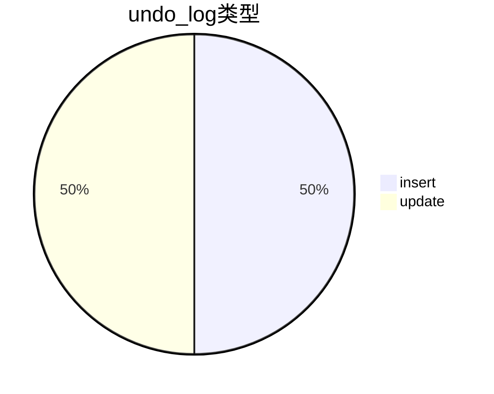

```mermaid
pie 
    title innodb表空间文件ibdata1
    "回滚段(undo_log)" : 42.96
    "数据段" : 42.96
    "索引段" : 42.96
```

```mermaid
pie 
    title  undo_log类型
    "insert" : 42.96
    "update" : 42.96
```
---

```mermaid
graph LR;
insert请求-->mysql   
mysql-->redo_log写入状态为prepare-->写入bin_log-->redo_log状态更新为已提交-->删除产生的undo_log
mysql-->写入一条delete数据的undo_log
写入一条delete数据的undo_log-->写入redo_log
```

----

```mermaid
graph LR;
DELETE/UPDATE请求-->mysql   
mysql-->redo_log写入状态为prepare-->写入bin_log-->redo_log状态更新为已提交-->undo_log放入链表
mysql-->写入一条update数据的undo_log-->写入redo_log
```
---

```mermaid
graph LR;
Query--快照读MVCC-->mysql   
mysql-->RR--获取事务开始时快照数据-->undo_log
mysql-->RC--获取最新的快照数据-->undo_log
```

