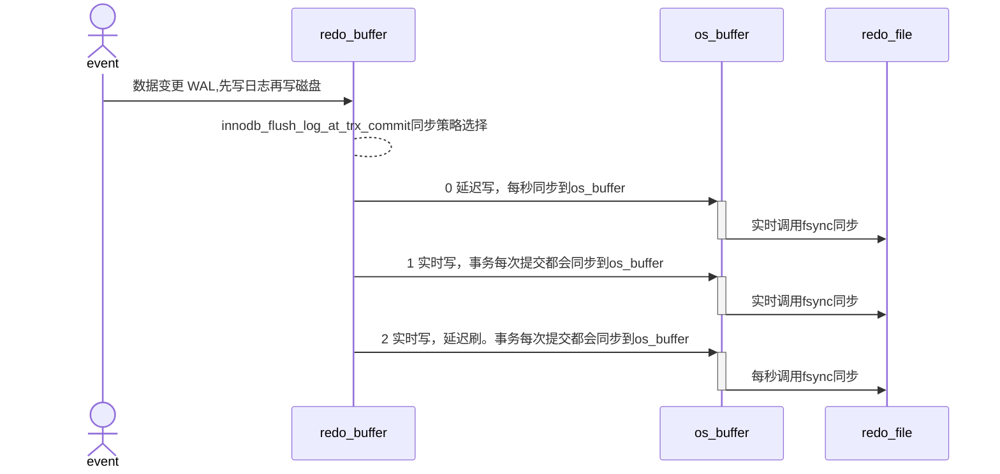

```mermaid
sequenceDiagram
		actor event
    participant redo_buffer
    participant os_buffer
    participant redo_file
    
    event->>redo_buffer:数据变更 WAL,先写日志再写磁盘
    redo_buffer-->redo_buffer:innodb_flush_log_at_trx_commit同步策略选择
    redo_buffer->>+os_buffer:0 延迟写，每秒同步到os_buffer
    os_buffer->>-redo_file:实时调用fsync同步
    
    redo_buffer->>+os_buffer:1 实时写，事务每次提交都会同步到os_buffer
    os_buffer->>-redo_file:实时调用fsync同步
    
    redo_buffer->>+os_buffer:2 实时写，延迟刷。事务每次提交都会同步到os_buffer
    os_buffer->>-redo_file:每秒调用fsync同步
    
```

