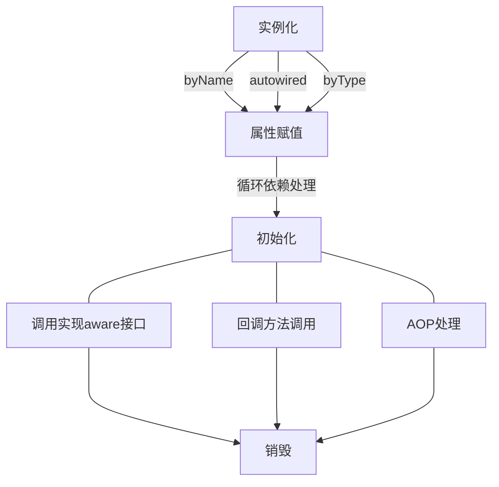

```mermaid
graph TD;
    实例化--byName-->属性赋值    
    实例化--autowired-->属性赋值
    实例化--byType-->属性赋值

    属性赋值--循环依赖处理-->初始化
    初始化---调用实现aware接口--->销毁
    初始化---回调方法调用--->销毁
    初始化---AOP处理--->销毁


    
```