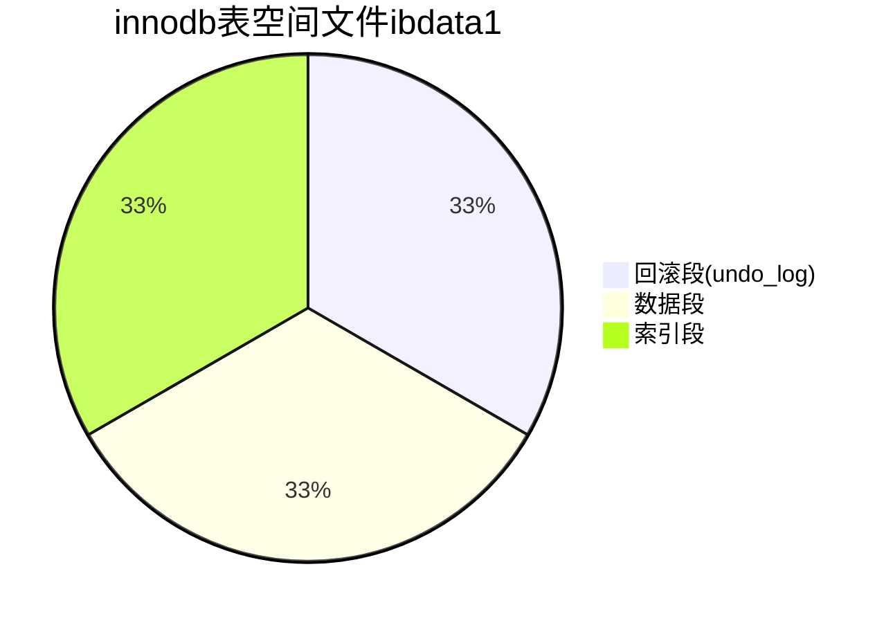
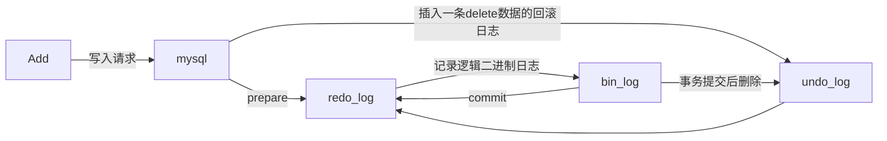

```mermaid
pie 
    title innodb表空间文件ibdata1
    "回滚段(undo_log)" : 42.96
    "数据段" : 42.96
    "索引段" : 42.96
```
---

```mermaid
graph LR;
Add--写入请求-->mysql   
mysql--prepare-->redo_log--记录逻辑二进制日志-->bin_log--commit-->redo_log
mysql--插入一条delete数据的回滚日志-->undo_log
undo_log-->redo_log
bin_log--事务提交后删除-->undo_log
```
---

```mermaid
sequenceDiagram
	actor event
    participant redo_buffer
    participant os_buffer
    participant redo_file
 
```

----

```mermaid
graph LR;
Delete--删除请求-->mysql   
mysql--prepare-->redo_log--记录逻辑二进制日志-->bin_log--commit-->redo_log
mysql--插入一条insert数据的回滚日志-->undo_log-->redo_log
```
---

```mermaid
graph LR;
Query--快照读MVCC-->mysql   
mysql-->RR--获取事务开始时快照数据-->undo_log
mysql-->RC--获取最新的快照数据-->undo_log
```

