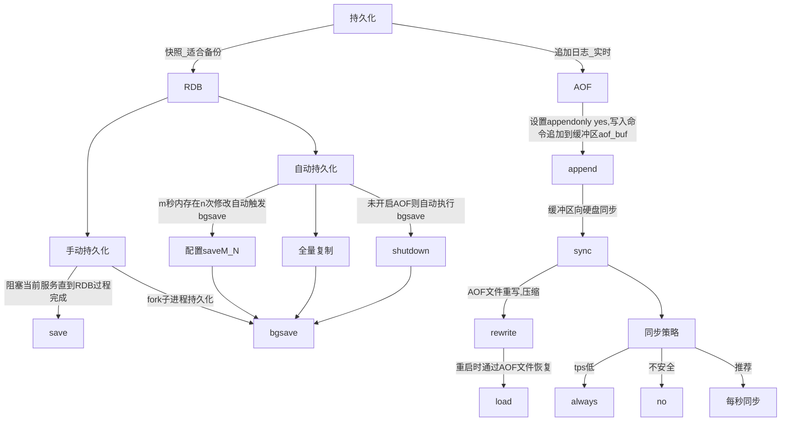

```mermaid
graph TB;
持久化 --快照_适合备份--> RDB
持久化--追加日志_实时-->AOF
RDB-->手动持久化
RDB-->自动持久化
手动持久化--阻塞当前服务直到RDB过程完成-->save
手动持久化--fork子进程持久化-->bgsave
自动持久化--m秒内存在n次修改自动触发bgsave-->配置saveM_N-->bgsave
自动持久化-->全量复制-->bgsave
自动持久化--未开启AOF则自动执行bgsave-->shutdown-->bgsave
AOF--设置appendonly yes,写入命令追加到缓冲区aof_buf-->append
append--缓冲区向硬盘同步-->sync
sync--AOF文件重写,压缩-->rewrite
rewrite--重启时通过AOF文件恢复-->load
sync-->同步策略
同步策略--tps低-->always
同步策略--不安全-->no
同步策略--推荐-->每秒同步


```

