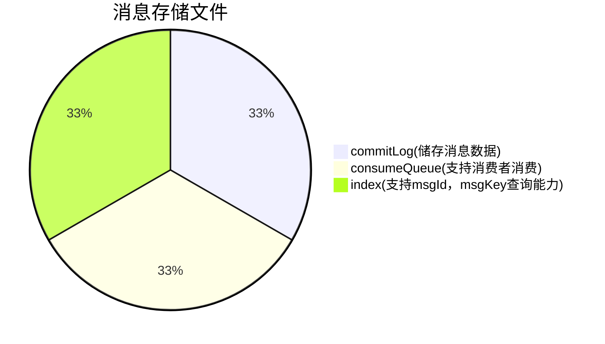
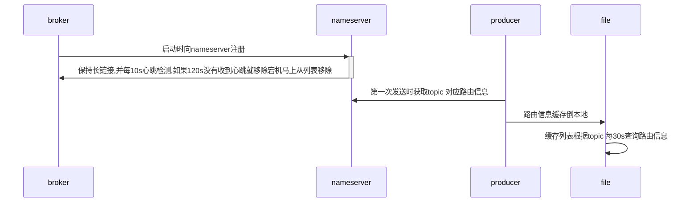
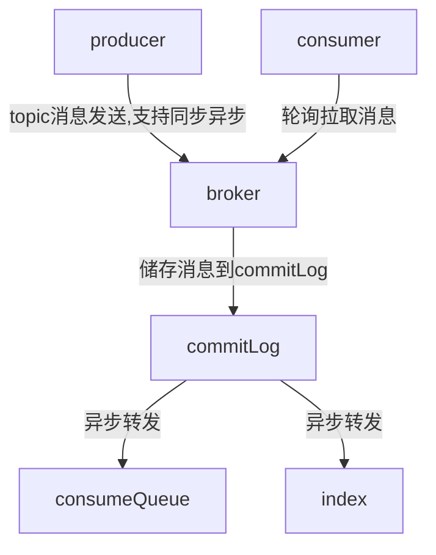
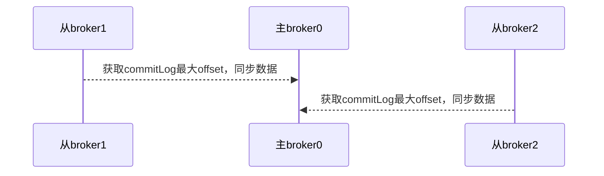

```mermaid
pie 
    title 消息存储文件
    "commitLog(储存消息数据)" : 42.96
    "consumeQueue(支持消费者消费)" : 42.96
    "index(支持msgId，msgKey查询能力)" : 42.96
```
---

```mermaid
sequenceDiagram
    participant broker
    participant nameserver
    participant producer

    broker->>+nameserver:启动时向nameserver注册
    nameserver->>-broker:保持长链接,并每10s心跳检测,如果120s没有收到心跳就移除宕机马上从列表移除

    producer->>nameserver:第一次发送时获取topic 对应路由信息
    producer->>file: 路由信息缓存倒本地
    file->>file: 缓存列表根据topic 每30s查询路由信息

```
---

```mermaid
graph TD;
producer--topic消息发送,支持同步异步-->broker
broker--储存消息到commitLog-->commitLog
commitLog--异步转发-->consumeQueue
commitLog--异步转发-->index
consumer--轮询拉取消息-->broker
```
---

```mermaid
sequenceDiagram

    participant 从broker1
    participant 主broker0
    participant 从broker2
    
    从broker1-->>主broker0:获取commitLog最大offset，同步数据
    从broker2-->>主broker0:获取commitLog最大offset，同步数据

```

