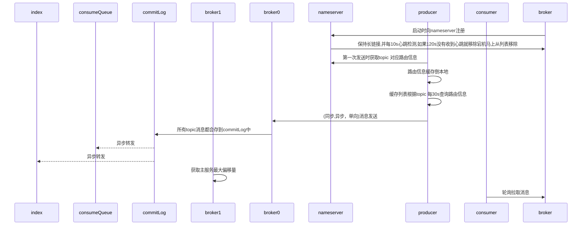

```mermaid
sequenceDiagram


    participant index
    participant consumeQueue 
    participant commitLog
    
    participant broker1
    participant broker0 
  
    participant nameserver
    participant producer
    participant consumer

    broker->>nameserver:启动时向nameserver注册
    nameserver->>broker:保持长链接,并每10s心跳检测,如果120s没有收到心跳就移除宕机马上从列表移除

    producer->>nameserver:第一次发送时获取topic 对应路由信息
    producer->>producer: 路由信息缓存倒本地
    producer->>producer: 缓存列表根据topic 每30s查询路由信息
    producer->>broker0:(同步,异步，单向)消息发送
    broker0->>commitLog:所有topic消息都会存到commitLog中
    commitLog-->>consumeQueue:异步转发
    commitLog-->>index :异步转发 
    
    broker1->>broker1:获取主服务最大偏移量
    
    consumer->>broker:轮询拉取消息

```
